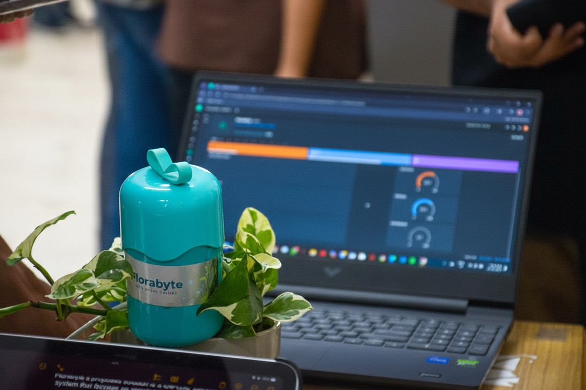

# SGMS
An affordable IoT-based plant monitoring system that tracks soil moisture, temperature, and humidity. Sends smartphone notifications when your plants need water - perfect for urban gardeners!
# 🌱 Smart Plant Monitoring System

A low-cost, IoT-based solution for monitoring plant health in real-time. This system provides data-driven insights to help urban gardeners maintain optimal plant conditions.

## 🚀 Demo Video

## Features
- **Real-time Soil Moisture Monitoring**
- **Temperature & Humidity Tracking**
- **Mobile App Notifications** via email when plants need water
- **Cloud Dashboard** for data visualization using Blynk iot platform and app
- **Low-cost & Easy to Setup**

##  Hardware Components
- NodeMCU ESP8266
- Capacitive Soil Moisture Sensor
- DHT11 Temperature/Humidity Sensor
- Breadboard (optional )& Jumper Wires
- USB Cable
- Plant Pot with Soil

## Prerequisites
- Arduino IDE installed
- ESP8266 board support package
- Blynk account as used in this project but we can also use thingspeak 
- Wi-Fi credentials - 2.4Ghz

## Installation & Setup

### 1. Hardware Connections
| Sensor | NodeMCU Pin |
|--------|-------------|
| Soil Moisture | A0 |
| DHT11 VCC | 3.3V |
| DHT11 GND | GND |
| DHT11 DATA | D2 |

### 2. Software Setup
1. Clone this repository
2. Open `SGMS.ino` in Arduino IDE
3. Configure your Wi-Fi credentials and Blynk auth token
4. Upload the code to NodeMCU

### 3. Mobile App Setup
1. Download Blynk IoT app
2. Create a new project with same auth token
3. Add widgets:
   - Gauge for soil moisture
   - Display for temperature/humidity
   - Notification alert

## Working Demo

*Hardware connections*

*Live data on Blynk app*

*Complete working system*

## How It Works
1. Sensors collect soil moisture, temperature, and humidity data
2. NodeMCU processes the data and connects to Wi-Fi
3. Data is sent to Blynk cloud via MQTT protocol
4. Mobile app displays real-time values and graphs
5. System triggers notifications when soil is dry via email

## Code Overview
The main code handles:
- Sensor data reading and calibration
- Wi-Fi connectivity management
- Cloud data transmission
- Alert logic based on moisture thresholds

## Impact
- **Affordability**: Total cost under $15
- **Accessibility**: No gardening experience required
- **Efficiency**: Prevents over/under-watering
- **Scalability**: Can monitor multiple plants

